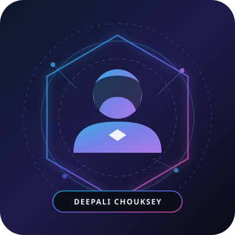

# Deepali Chouksey - Personal Portfolio

A modern, high-performance, dark futuristic portfolio website created for **Deepali Chouksey** (Aspiring Software Engineer & AI/ML Developer).



---

## 🌟 Key Features

- **Dark Futuristic Theme**: Deep charcoal backgrounds, electric cyan and cyber-indigo gradient accents, glassmorphic cards with subtle neon glow borders.
- **Interactive Background**: Custom HTML5 Canvas particle/mesh network that dynamically links floating nodes.
- **Dynamic Typing Animation**: Smooth real-time typewriter rotation across Deepali's key roles.
- **Structured Sections**:
  - **Hero Section**: Bio, status badge, call-to-actions, social channels, and profile portrait.
  - **About Me**: Computer science background, problem-solving mindset, and core values.
  - **Skills**: Filterable cards with animated progress indicators covering Python, C, C++, JavaScript, HTML5, CSS3, Git, GitHub, AI/ML, and DSA.
  - **Featured Projects**: High-impact showcases (AI Medical Diagnostics, AlgoPulse Visualizer, IntelliPredict Machine Learning, DevConnect Web App).
  - **Education**: Interactive timeline with degree, coursework, and school history.
  - **Experience & Internships**: Practical project experience and technical leadership timeline.
  - **Certificates**: Credential cards with verification badges.
  - **Achievements**: Hackathons, 200+ solved DSA problems, and open source milestones.
  - **Contact**: Interactive contact form with client-side validation, 1-click email copy button, and direct links.
- **Responsive & Mobile-First**: Tailored layouts for smartphones, tablets, laptops, and wide screens.
- **Zero Heavy Dependencies**: Pure semantic HTML5, CSS3, and vanilla JavaScript for blazing-fast load times.
- **Vercel Ready**: Preconfigured `vercel.json` with security headers and clean URL routing.

---

## 🚀 How to Add Your Real Profile Photo

1. Take your professional headshot image and name it `profile.jpg`.
2. Save it directly into the `assets/` folder:
   ```
   e:/deepali/assets/profile.jpg
   ```
3. Refresh the website in your browser! The site is configured to automatically load `assets/profile.jpg`, and gracefully falls back to the SVG avatar if the file is absent.

---

## 🌐 Deploying to Vercel

### Option 1: Via Vercel CLI
```bash
# Install Vercel CLI (if not already installed)
npm install -g vercel

# Deploy directly from this directory
vercel
```

### Option 2: Via GitHub & Vercel Dashboard
1. Create a new repository on your GitHub account (e.g., `deepali-portfolio`).
2. Push this folder to GitHub:
   ```bash
   git init
   git add .
   git commit -m "Initial commit of Deepali Chouksey portfolio"
   git branch -M main
   git remote add origin https://github.com/<YOUR_GITHUB_USERNAME>/<YOUR_REPO>.git
   git push -u origin main
   ```
3. Go to [vercel.com](https://vercel.com/), click **Add New Project**, import your repository, and click **Deploy**. Your portfolio will be live worldwide in seconds!

---

## 📬 Contact Information

- **Name**: Deepali Chouksey
- **Email**: [deepalichouksey36@gmail.com](mailto:deepalichouksey36@gmail.com)
- **LinkedIn**: [https://www.linkedin.com/in/deepali-chouksey-306528332](https://www.linkedin.com/in/deepali-chouksey-306528332)
- **Location**: Bhopal, Madhya Pradesh, India
